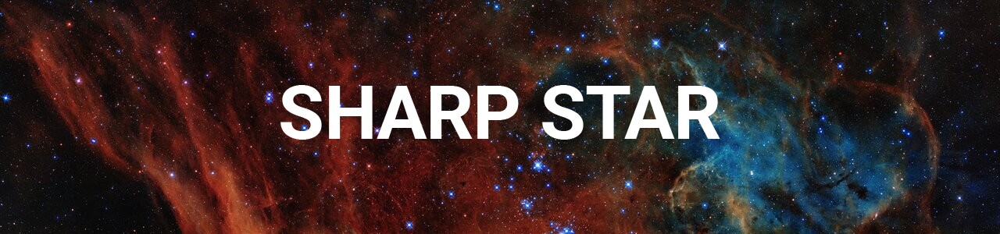
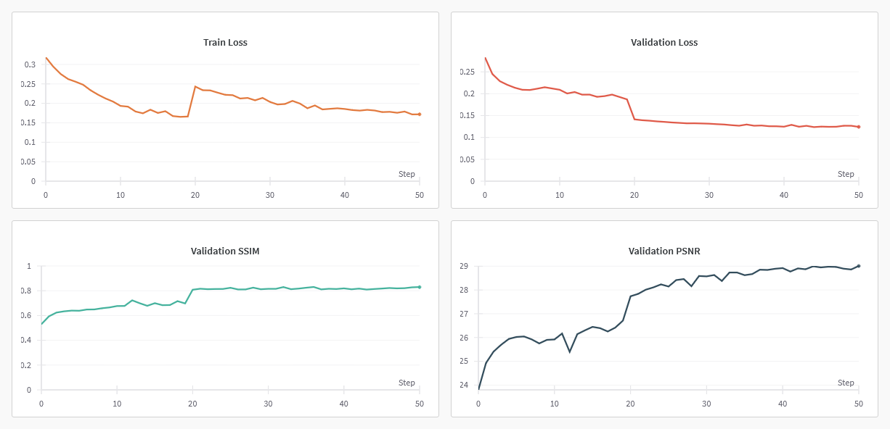

[](https://www.python.org/downloads/)


[](LICENSE)

### Sharp Star ✨ is a neural model that sharpens and deblurs your astro images.

## Table of Contents

- [Table of Contents](#table-of-contents)
- [Installation](#installation)
- [Usage](#usage)
  - [Inference](#inference)
  - [Training](#training)
  - [Visualization](#visualization)
- [Dataset](#dataset)
- [Evaluation](#evaluation)
- [Results](#results)
- [Licence](#licence)

## Installation

To get started, clone the repository:

```bash
git clone https://github.com/ArisChristoforidis/sharp-star
cd sharp-star
```

[__Recommended__] Create a virtual environment and install dependencies:

```bash
python -m venv venv
venv\Scripts\activate  # On Windows
# source venv/bin/activate  # On macOS and Linux
pip install -r requirements.txt
```

## Usage

### Inference

Run `predict.py` to perform inference on an image.

__Options__


| Args | Description                                     |
|--------------|-------------------------------------------------|
| `--input`    | The path to the input image.                       |
| `--output`   | The path to save the output (predicted) image.      |
| `--model`    | The path to the trained model file.                 |
| `--batch`    | The batch size for processing the image.            |
| `--patch`    | The size of the image patches used for processing. |

__Example__

```
python predict.py --input input.jpg --output out.jpg --model model.pth --batch 8 --patch 512
```

### Training

You can use `train.py` to train your own model. The script has [Weights & Biases](wandb.ai) integration, so if you want to log metrics, you should first run `wandb login` and provide your _API KEY_.

__Options__

| Args    | Description                                             |
|------------------|------------------------------------------------|
| `--checkpoint`   | The path to the model checkpoint if it exists. |
| `--train`        | The path to the train set.                     |
| `--eval`         | The path to the evaluation set.                |
| `--output`       | The output path for the model.                 |
| `--learning_rate`| The default learning rate.                     |
| `--batch`        | The batch size.                                |
| `--epochs`       | The number of epochs to train for.             |
| `--log`          | Whether to log metrics to wandb or not.        |

__Example__

```
python train.py --checkpoint models/model.pth --train data/train --eval data/eval output models/updated_model.pth --learning_rate 0.001 --batch 32 --epochs 20 --log True
```

__Some additional notes on the training script__

- I use [autocast](https://docs.pytorch.org/docs/stable/amp.html) for automatic mixed precision (fp32/fp16). Initially, this caused my gradients to become NaN after a few epochs which basically killed the training process. I found that the issue is caused by `float16` producing numerical errors on higher learning rates and is resolved by dropping the LR below __1e-4__. I also clip my grad norm to make sure they remain within an acceptable range.
- The model is [compiled](https://docs.pytorch.org/tutorials/intermediate/torch_compile_tutorial.html) which results in a small but significant performance gain. Combined with autocast, I can run an epoch (25000 images, batch size 32) on a T4 in around 5 minutes. In comparison, without these optimizations, each epoch takes around 10 minutes.
- I use [ReduceLROnPlateau](https://docs.pytorch.org/docs/stable/generated/torch.optim.lr_scheduler.ReduceLROnPlateau.html) to adjust my learning rate dynamically when needed.

### Visualization

The `visualize.py` script can be used to view a set of input, prediction (and ground truth if available) images.

__Options__

| Args    | Description                                           |
|----------------- |----------------------------------------------|
| `--input`        | The path to the input image.                 |
| `--ground`       | The path to the ground truth image or None.  |
| `--model`        | The path to the model.                       |

__Example__

```
python vizualize.py --input input.jpg --ground ground.jpg --model models/model.pth
```


## Dataset

I created the dataset by scraping the `r/astrophotography` subreddit. While I don't provide the training data in the repo, you can use `01-fetch-dataset.ipynb` in the `notebooks` folder to download and organize a similar dataset. You may also run `02-process-images.ipynb` and `03-split-data.ipynb` in that order to get the data ready for training.

_Note_: I use [__PRAW__](https://github.com/praw-dev/praw) to fetch data from Reddit. You will need to setup a __REDDIT API KEY__ and place it in an .env folder. Here is how that should look like:

```
REDDIT_CLIENT_ID=
REDDIT_CLIENT_SECRET=
REDDIT_USER_AGENT=
REDDIT_USERNAME=
REDDIT_PASSWORD=
```

You can get more info on configuring PRAW [here](https://praw.readthedocs.io/en/stable/getting_started/authentication.html)

## Evaluation

The training is currently underway, but in the meantime, here are some graphs from wandb



## Results

Below you can see some examples of model outputs compared to the input and ground truth images.


Image Credit: [/u/carnage-chambers](https://www.reddit.com/r/astrophotography/comments/1k22wvz/the_merging_antennae_galaxies_in_corvus_ngc/)

## Licence

MIT
